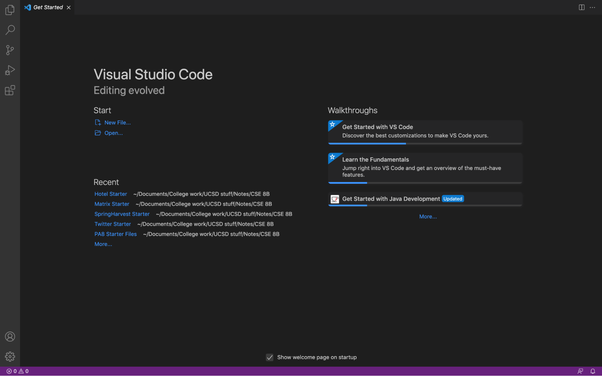
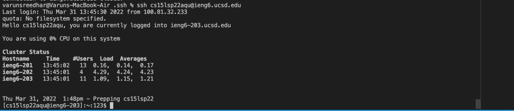
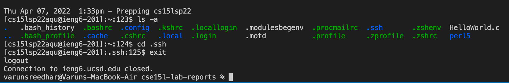
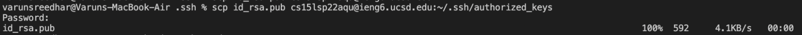
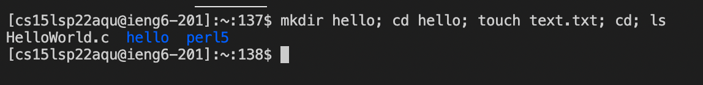

# Lab Report 1

---

Hello! This is a tutorial for how to log into ieng6.

1. The first step to log into ieng6 is to download vscode. Vscode is a free text editor that you can use for coding. 

2. The next step after you download vscode is you need to ssh into ieng6. You can do this by running `ssh <username>@ieng6.ucsd.edu` and then entering your password

3. The next step now that you are inside of ieng6 is to now try running some commands some common commands that you use are 

    * `ls -a` To list all files
    * `cd <directory name>` to enter a folder
    * `cat <file>` To create a file
    * `exit` To exit ieng6

4. Once you exit ieng6 we can try to copy files with scp. To copy a file navigate to the directory that the file is in. Then in the terminal you can type: `scp <filename> <username>@ieng6.ucsd.edu:~/`. This will copy the file to the root folder on ieng6.

5. The next thing that you want to do is set up an ssh key so you do not have to type your password every time that you want to login. To do this follow the steps below:

    * Login into ieng6 and use `mkdir` to make a .ssh folder.
    * Once you do that you can enter the .ssh folder and use `mkdir` again to create an authorized_keys folder
    * Log out of ieng6
    * Type `ssh-keygen`
    * Once you do this it will create a public key and a private key.
    * Navigate to the folder where the public key and private key are stored.
    * Type `scp id_rsa.pub <username>@ieng6.ucsd.edu:~/.ssh/authorized_keys` to copy the public key to ieng6
    * Once you do that you are able to login without a password

6. Now if you have noticed it takes a long time to type some of the commands needed to move around. To get around this there are some ways to chain multiple commands together.

    * You can use semicolons to chain together multiple statements. For example `mkdir hello; cd hello; touch text.txt` will make a folder enter that folder and then create the text file.
    * The up arrow allows you to recall the last command that you called
    * You can also type: `ssh <username>@ieng6.ucsd.edu "ls"` to login and then run the command that is in the quotes.

Here is an example of me using the multicommand to create a text file inside of a new folder

That is the end of my first last report. Thank you for reading!
