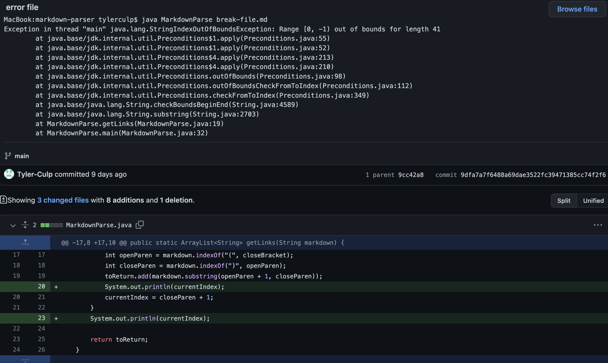
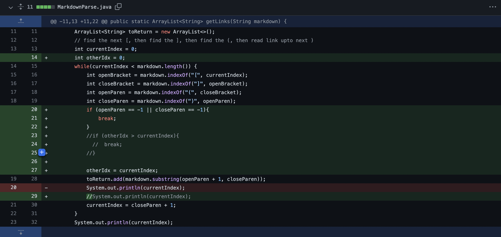
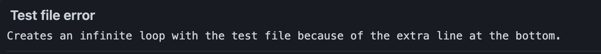
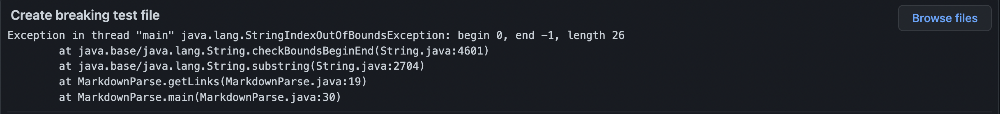

# Lab Report 2

---

Hello! Welcome to lab report 2! Today we will be talking about 3 code changes that we made to the markdown parser code during lab 3.

1. The first code change that we made:

    a. Here is an image of the first code change commit:
    

    b. The file that caused this failure inducing input was [this one](https://github.com/Tyler-Culp/markdown-parser/blob/main/break-file.md)

    c. From the image above we can see that the symptom of a failure was the `java.lang.StringIndexOutOfBoundsException`.

    d. The relation between the bug, the symptom, and the failure inducing input was the input and the bug were the ones that caused the index to increase past the length of the string. This resulted in java throwing the symptom which was the `java.lang.StringIndexOutOfBoundsException`

2. The second code change we made:

    a. Here is an image of the second code change commit:
    

    b. The file that caused the failure is [this one](https://github.com/Tyler-Culp/markdown-parser/blob/main/test-file.md)

    c. From the commit message we can see that the symptom of this failure was the infinite loop.
    

    d. The relationship between the bug, the symptom, and the failure inducing input was that the the failure inducing input had an extra line at the bottom which caused the bug to run the while loop forever. The symptom of this appeared in the form of an infinite loop.

3. The third code change we made:

    a. The third code change is too big to be an image so here is a [link](https://github.com/Combobyte/markdown-parser/commit/5e99905e1fa7667be84c889b739796d84d015366) to the code diff.

    b. The file that caused this failure is [this one](https://github.com/Combobyte/markdown-parser/blob/main/test-file.md)

    c. From the image below we can see that the symptom of the error is the `java.lang.StringIndexOutOfBoundsException`.
    

    d. The relationship between the bug, the symptom, and the failure inducing input was that the the failure inducing input didn't have any brackets after the last parentheses at the bottom which caused the bug to throw the exception. The symptom of this appeared in the form of the exception being thrown.
