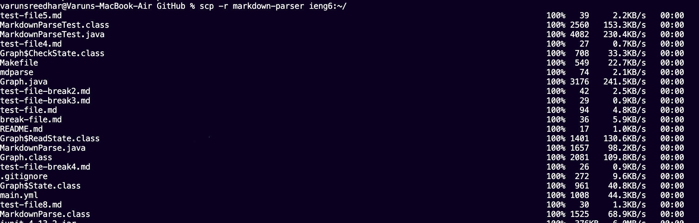

# Lab report 3

---

Hello! Welcome to lab 3 where we will talk about all of the 3 special activites from last week.

1. The first activity was streamlining ssh configuration

    a) Below we can see my ssh config file. I edited this file using `vi config` but showed it using `cat config`.

    

    b) Now we can see that I am able to log in using just `ssh ieng6`

    

    c) Now we can also use `scp` without having to type too much:

    

2. The second activity was making it so you could commit from the terminal on the cs15l account.

    a) Here is the screenshot of my pulic key on Github:

    

    b) And now we can see that the private key in on my user account in the .ssh folder:

    

    c) Here is me commiting and pushing on the user account. The link to the commit is [Here](https://github.com/Combobyte/markdown-parser/commit/05721a1014069e9122691325f8606f43e0e34bf5)

    

3. The third activity was copying full directories to the user account.

    a) we can use `scp -r` to copy the whole directory:

    

    b) We can then go onto the course specific account and run the tests:

    

    c) We can also see that we are able to copy and run in one step using the command `scp -r markdown-parser ieng6:~/; ssh ieng6 "cd markdown-parser; make test`. The image doesn't show the run because of the amount of files being copied, but it did run the test:

    

Thanks for reading!