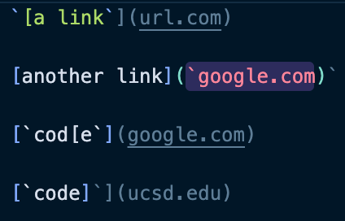
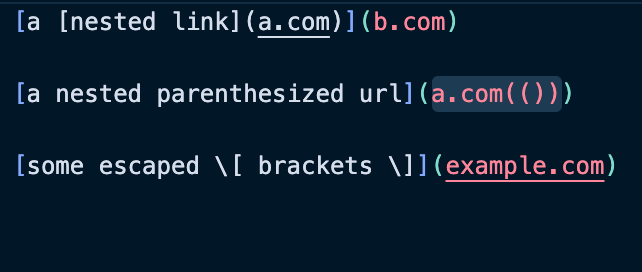
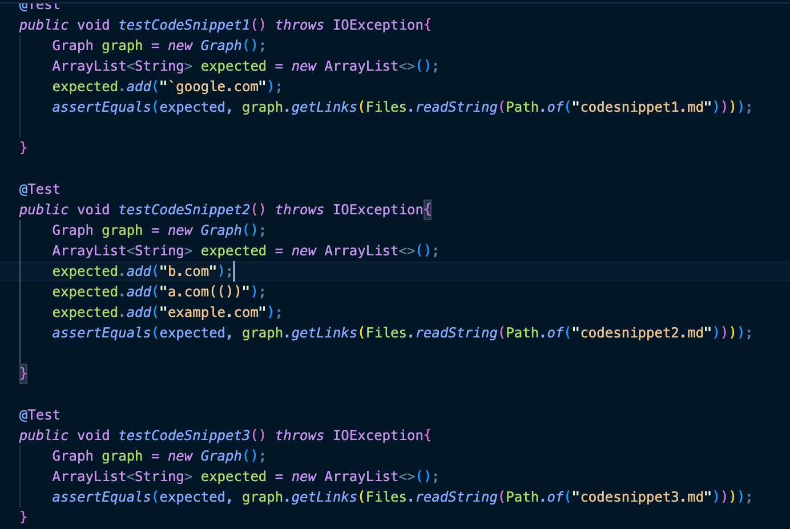
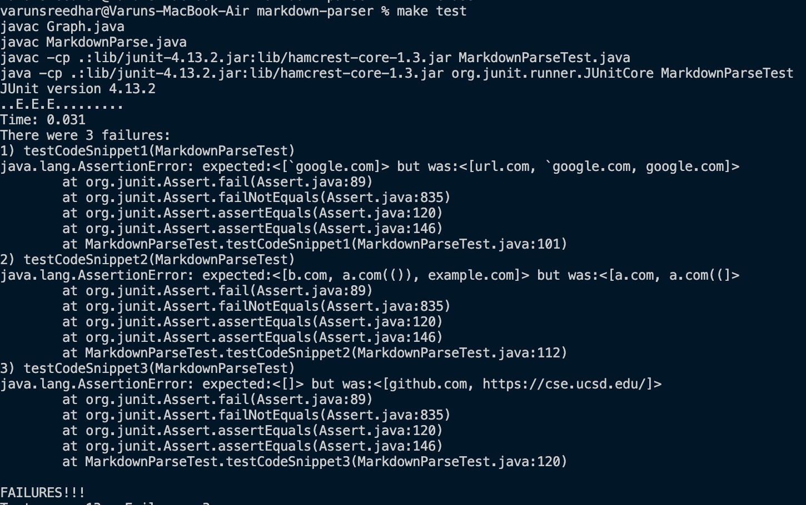
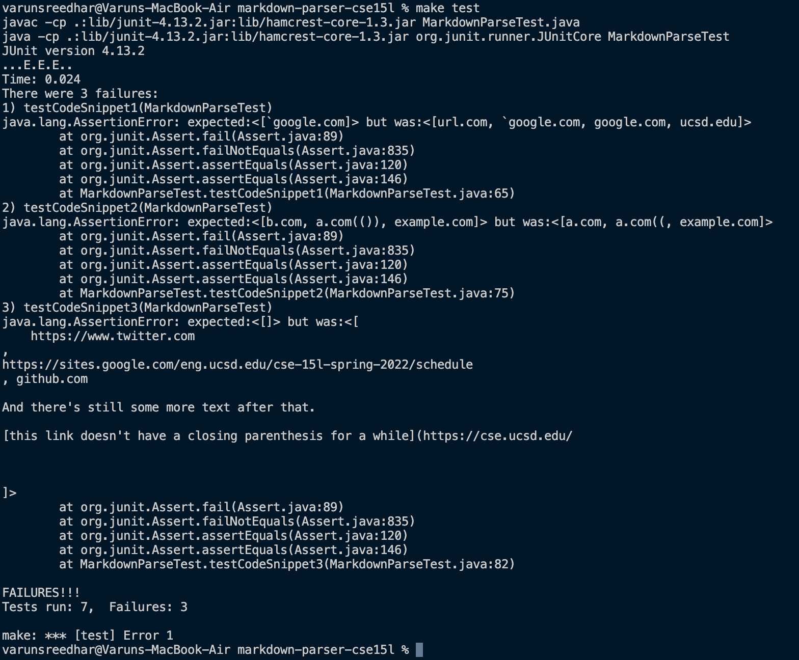

# Lab report 4

---

Hello! Welcome to lab report 4 where we will test both our group's repository whihc can be found [here](https://github.com/Combobyte/markdown-parser) and our partner group's repository which can be found [here](https://github.com/nquach1515/markdown-parser-cse15l) on some new code snippets. These 3 snippets and their expected results can be see in the following images:

1. Code snippet 1:
    

2. Code snippet 2:
    

3. Code snippet 3:
    

Now to test these code snippets we can see that the following test cases were added to each repository:
    

The results of said tests were:

1. Our repository:
    

2. Their repository:
    

Now we will must wonder how to fix the code:

1. For code snippet one I believe that the way to fix this is to add another state to my `Graph.java` class which will account for the backticks. This code change will take around 15 lines of code.

2. To fix code snippet two I believe that I would again modify the `Graph.java` class by adding some more states to make sure to count the number of parentheses inside of the link portion of the link.

3. To fix this I would need to stop returning the link portion when hitting a new line because if you see the only links that have been returned are the ones that have a new line at the end instead of a `)`. This would take a bit more changes to `Graph.java` but in theory shouldn't be too bad.

Thanks for reading