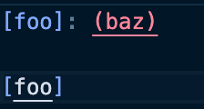
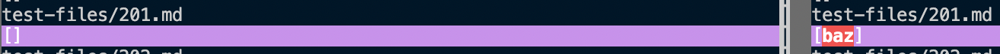
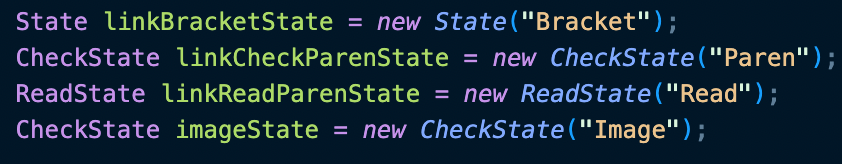
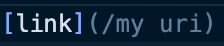
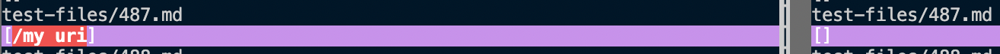

# Lab report 4

---

Hello! Welcome to lab report 5 where we are comparing implementations of `MarkdownParse.java`. Two of the tests in the `test-files` folder that had different results were files [201.md](https://github.com/nidhidhamnani/markdown-parser/blob/main/test-files/201.md) and [487.md](https://github.com/nidhidhamnani/markdown-parser/blob/main/test-files/487.md). I found these files through the use of the `vimdiff` command on  the outputs of the bash script for loop.

1. The first error was file `201.md`. The actual result is:

    

    the result that my version of `MarkdownParse.java` gives is on the left and the most recent version in the repository is on the right

    

    From this we can see that my version of `MarkdownParse.java` fails and the most updated one passes this test. The bug in my `MarkdownParse.java` is that I don't account for the split up link which means that this isn't counted as a link. To fix this I would have to write another state for my `Graph.java` to account for this:

    

2. The second error was file `487.md`. The actual result is:

    

    the result that my version of `MarkdownParse.java` gives is on the left and the most recent version in the repository is on the right

    

    From this we can see that my version of `MarkdownParse.java` fails and the most updated one passes this test. The bug in my `MarkdownParse.java` is that I don't account for the escape character in the link. To fix this I would have to write another state for my `Graph.java` to account for this:

    